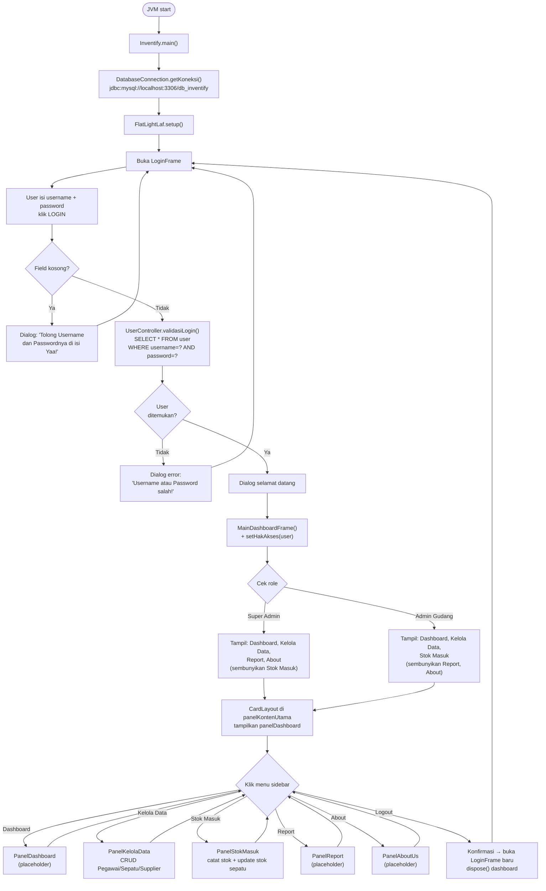
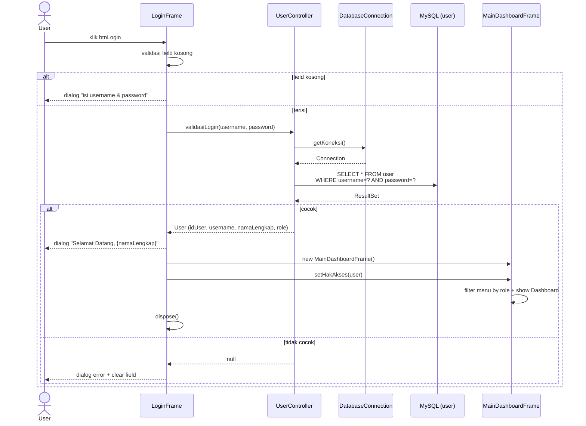
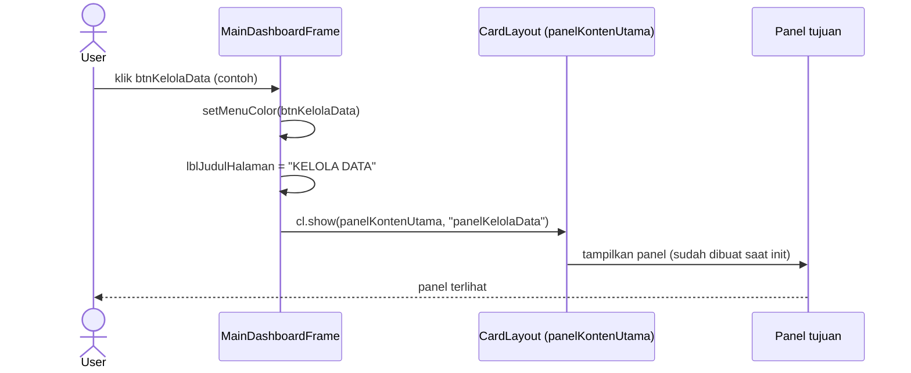
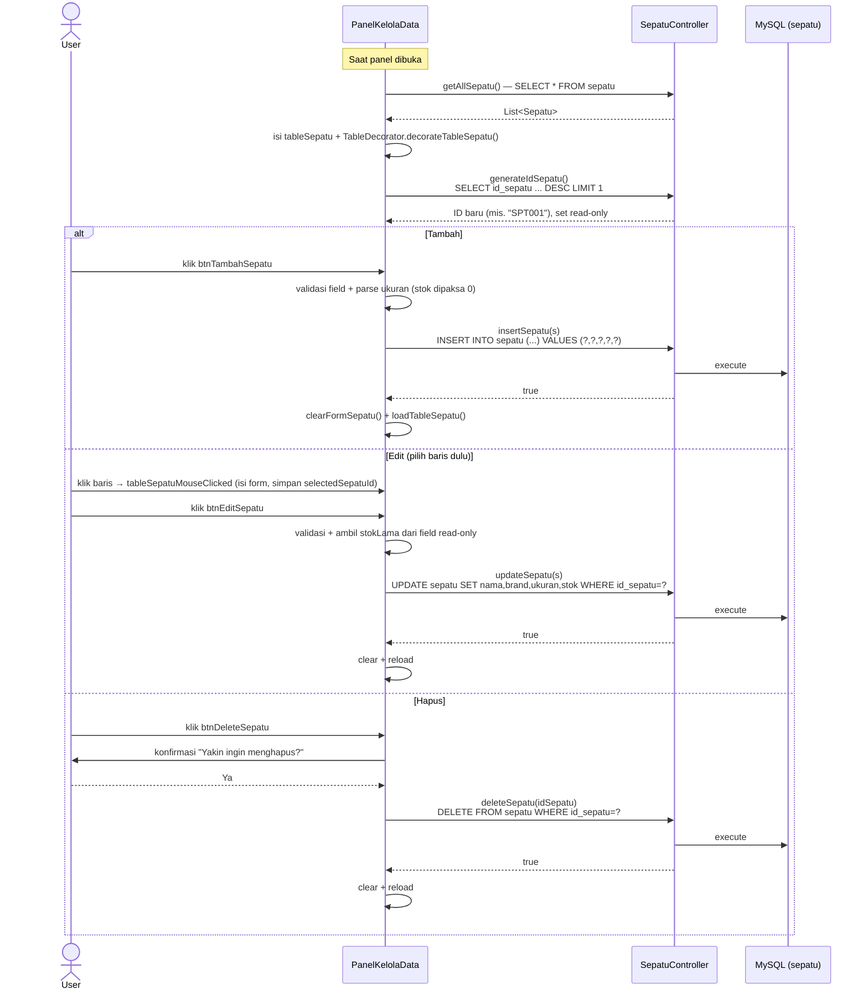
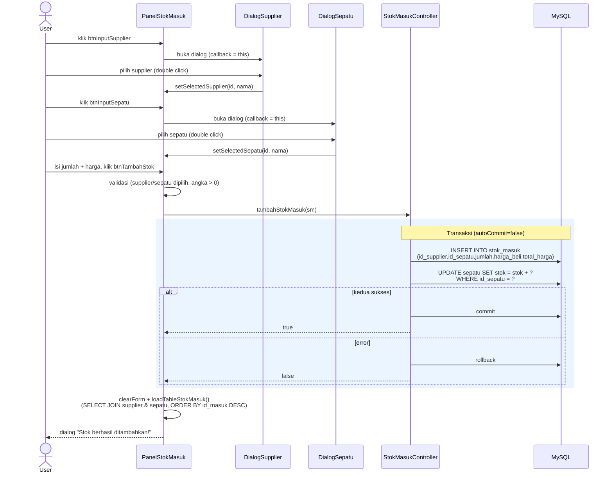

# Arsitektur Inventify

Aplikasi desktop Java Swing (NetBeans Ant project) untuk manajemen inventaris toko sepatu. Database MySQL `db_inventify` di `localhost:3306`, theme FlatLaf, arsitektur MVC sederhana (model / view / controller + lapisan koneksi).

## Lapisan & Tanggung Jawab

| Lapisan | Paket | Isi |
|---------|-------|-----|
| Entry | `inventify` | `Inventify.main()` — bootstrap koneksi + tema + buka login |
| Koneksi | `koneksi` | `DatabaseConnection.getKoneksi()` — provider `Connection` MySQL |
| View | `view` | `LoginFrame`, `MainDashboardFrame`, dan 5 panel konten |
| Dialog | `dialog` | `DialogSepatu`, `DialogSupplier` — picker untuk Stok Masuk |
| Controller | `controller` | `UserController`, `SepatuController`, `SupplierController`, `StokMasukController` |
| Model | `model` | `User`, `Sepatu`, `Supplier`, `StokMasuk` (POJO) |
| Util | `util` | `TableDecorator` — styling `JTable` (static) |

---

## 1. Alur Aplikasi Keseluruhan (Flowchart)

> Catatan: `PanelDashboard`, `PanelReport`, dan `PanelAboutUs` saat ini masih placeholder (hanya satu `JLabel`, tanpa query DB).

---

## 2. Sequence — Login & Masuk Dashboard

> Catatan keamanan: password dibandingkan plaintext (tanpa hashing); kredensial DB di-hardcode di `DatabaseConnection`. Query memakai `PreparedStatement` sehingga aman dari SQL injection.

---

## 3. Sequence — Navigasi Antar Panel (CardLayout)

> Kelima panel dibuat sekali di `initComponents()`, lalu hanya ditukar tampil via `CardLayout` — bukan dibuat ulang on-demand.

---

## 4. Sequence — CRUD Master Data (Sepatu)

CRUD dilakukan inline di `PanelKelolaData` (form di atas tabel), bukan lewat dialog popup. Supplier mengikuti pola yang sama.

> Setelah setiap operasi sukses, tabel selalu dimuat ulang penuh dari DB (`loadTableSepatu()`), bukan mutasi baris in-place. Stok sepatu tidak bisa diubah di sini — hanya lewat Stok Masuk.

---

## 5. Sequence — Stok Masuk (catat + update stok sepatu)

> Edit stok masuk menerapkan **selisih** jumlah ke `sepatu.stok`; hapus stok masuk **mengurangi** kembali stok. Semua dalam satu transaksi agar konsisten.

---

## 6. Ringkasan SQL per Controller

| Controller | Method | SQL |
|------------|--------|-----|
| UserController | `validasiLogin` | `SELECT * FROM user WHERE username=? AND password=?` |
| UserController | `getAllUsers` | `SELECT * FROM user ORDER BY id_user ASC` |
| UserController | `insertUser` | `INSERT INTO user (username,password,nama_lengkap,no_hp,role) VALUES (?,?,?,?,?)` |
| UserController | `updateUser` | `UPDATE user SET username=?,password=?,nama_lengkap=?,no_hp=?,role=? WHERE id_user=?` |
| UserController | `deleteUser` | `DELETE FROM user WHERE id_user=?` |
| SepatuController | `getAllSepatu` | `SELECT * FROM sepatu` |
| SepatuController | `insertSepatu` | `INSERT INTO sepatu (id_sepatu,nama_sepatu,brand,ukuran,stok) VALUES (?,?,?,?,?)` |
| SepatuController | `updateSepatu` | `UPDATE sepatu SET nama_sepatu=?,brand=?,ukuran=?,stok=? WHERE id_sepatu=?` |
| SepatuController | `deleteSepatu` | `DELETE FROM sepatu WHERE id_sepatu=?` |
| SepatuController | `generateIdSepatu` | `SELECT id_sepatu FROM sepatu ORDER BY id_sepatu DESC LIMIT 1` |
| SupplierController | `getAllSupplier` | `SELECT * FROM supplier ORDER BY id_supplier ASC` |
| SupplierController | `insertSupplier` | `INSERT INTO supplier (nama_supplier,no_telp,alamat) VALUES (?,?,?)` |
| SupplierController | `updateSupplier` | `UPDATE supplier SET nama_supplier=?,no_telp=?,alamat=? WHERE id_supplier=?` |
| SupplierController | `deleteSupplier` | `DELETE FROM supplier WHERE id_supplier=?` |
| StokMasukController | `tambahStokMasuk` | `INSERT INTO stok_masuk (...)` + `UPDATE sepatu SET stok=stok+? WHERE id_sepatu=?` (transaksi) |
| StokMasukController | `getAllStokMasuk` | `SELECT sm.*, s.nama_supplier, sp.nama_sepatu FROM stok_masuk sm LEFT JOIN supplier s ... LEFT JOIN sepatu sp ... ORDER BY sm.id_masuk DESC` |
| StokMasukController | `editStokMasuk` | `UPDATE stok_masuk SET ...` + `UPDATE sepatu SET stok=stok+? (selisih)` (transaksi) |
| StokMasukController | `deleteStokMasuk` | `DELETE FROM stok_masuk ...` + `UPDATE sepatu SET stok=stok-?` (transaksi) |

---

## 7. Catatan Teknis & Temuan

- **Role-based access**: `MainDashboardFrame.setHakAkses()` menyembunyikan menu sesuai role; `PanelKelolaData.setHakAksesPanel()` menyembunyikan tab (Super Admin → kelola Pegawai; Admin Gudang → kelola Sepatu + Supplier).
- **Stok hanya berubah lewat Stok Masuk** — di Kelola Data field stok read-only dan dipaksa 0 saat insert.
- **Transaksi** dipakai di semua operasi `StokMasukController` agar `stok_masuk` dan `sepatu.stok` selalu sinkron.
- **Bug guard mati** di `PanelKelolaData` (Edit/Delete Sepatu): cek `selectedSepatuId == null`, padahal field hanya pernah `""` atau ID valid — guard tak pernah aktif.
- **`getKoneksi()` bukan singleton** — tiap panggilan membuat `Connection` baru dan menimpa field static; aman untuk app single-user tapi rapuh.
- **`DialogSepatu`/`DialogSupplier`** adalah picker read-only (filter di sisi Java), hanya dipakai oleh Stok Masuk — bukan dialog CRUD master data.
